# BirdNET-Pi_Flutter Frontend
This repository contains the source code of a Flutter frontend for the BirdNET-Pi project

## Navigation & Discovery

### Hamburger Menu (Drawer)
The side drawer provides access to all major sections of the application, including live streams, statistics, logs, and system tools. It also includes dedicated sections for species management (Inclusion, Exclusion, and Whitelists).
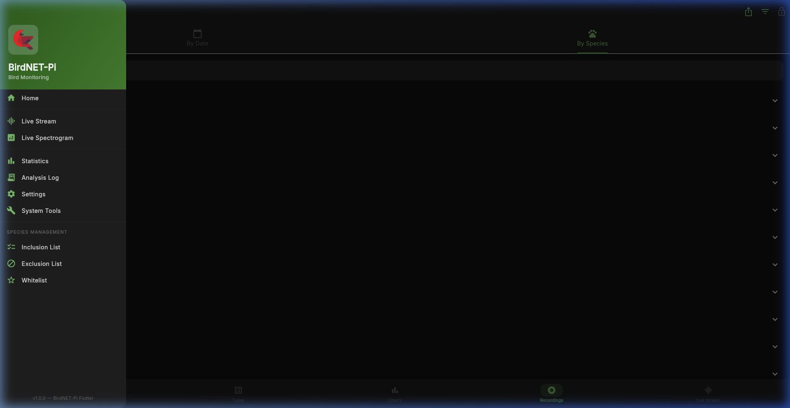

---

## Desktop Experience

The desktop layout is designed for large-scale monitoring and data analysis.

### Dashboard (Home)
The primary overview featuring global statistics, species hourly distribution heatmap, and a scrollable list of recent detections.
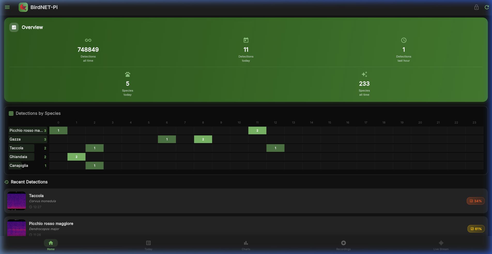

### Charts & Analytics
Deep-dive into detection trends with multiple time horizons.

#### Daily View
Shows the distribution of detections across the current day.
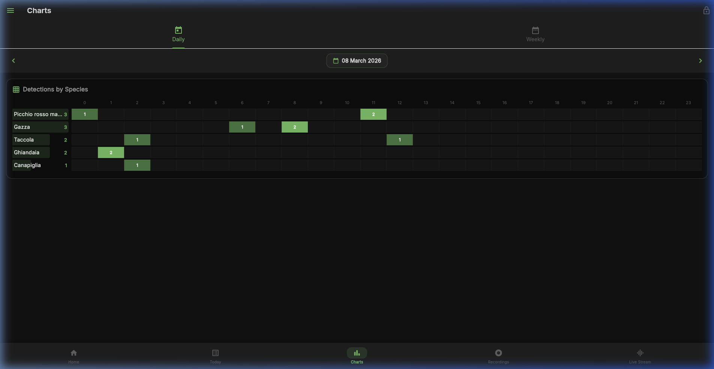

#### Weekly View
Provides a higher-level summary of the week's activity, comparing performance and species diversity.
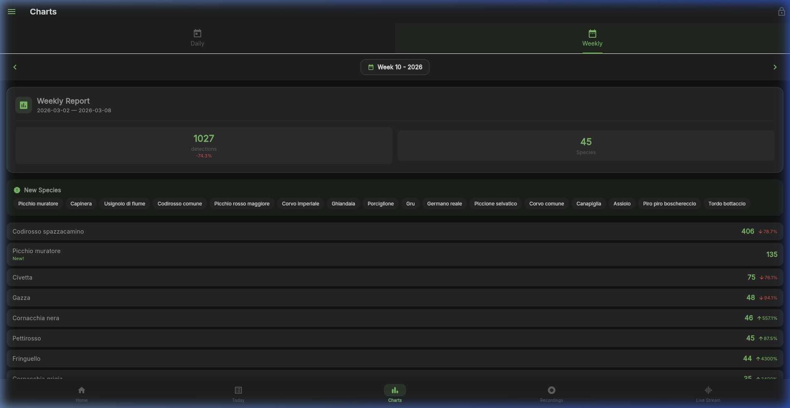

### Recordings Archive
Access the historical database of all identified birds.

#### By Date
Grouped by calendar day for chronological review.
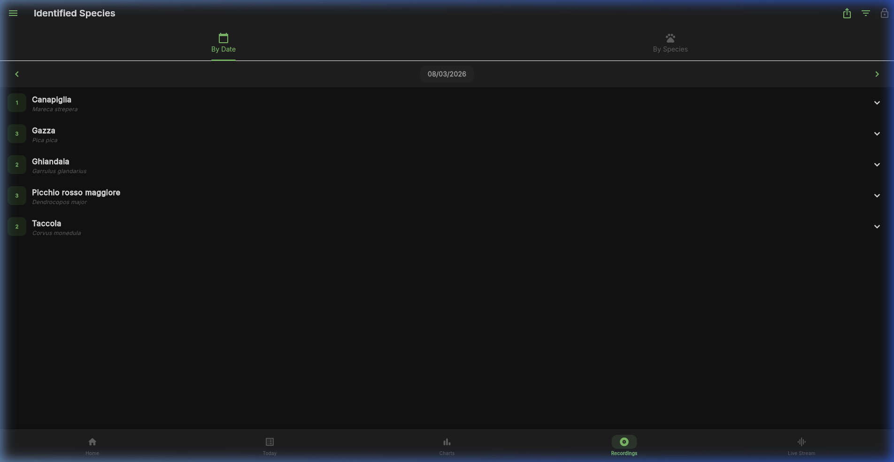

#### By Species
Aggregated by species to easily find all recordings of a specific bird.
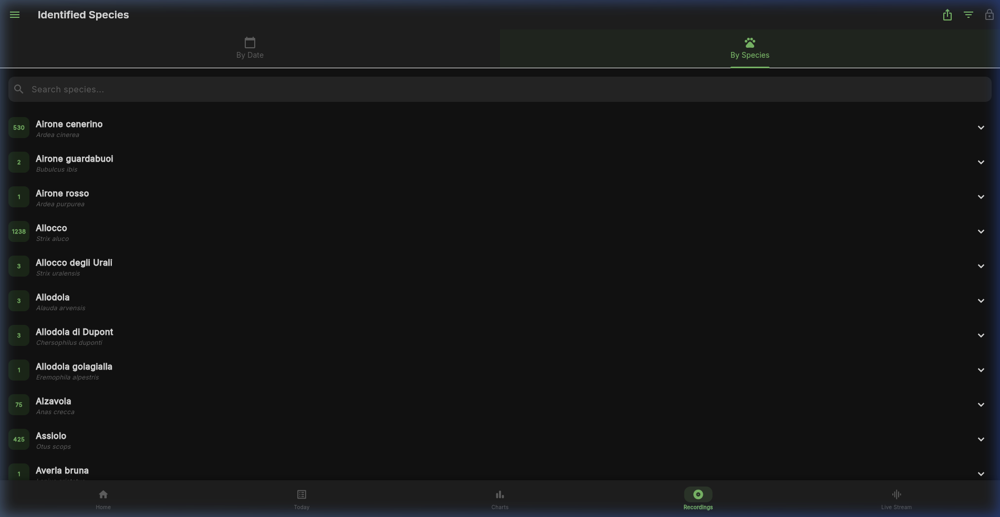

---

## Mobile Experience

Optimized for 1:1 interaction and field use.

### Mobile Dashboard
A vertically optimized version of the dashboard that preserves all critical data in a compact format.
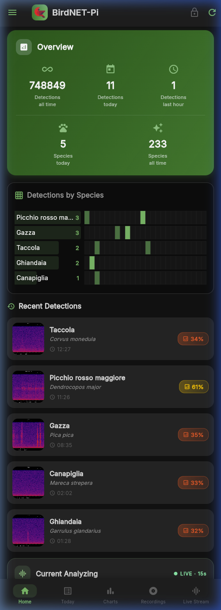

### Detection Detail Sheet
When tapping on a detection, a full-height detail sheet slides up. It includes:
- Species identification and confidence score.
- High-resolution spectrogram visualization.
- Integrated audio player for quick verification.
- Quick actions: Delete, Change ID, Protect, and Download.
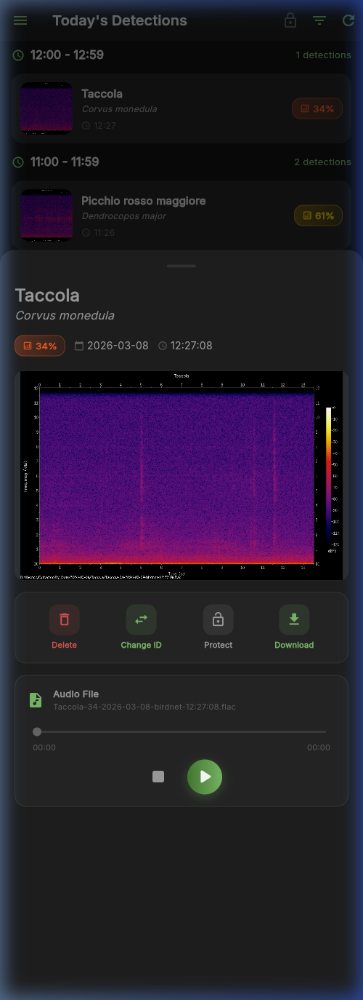

## Configuration & System Management

Access to these sections is restricted and requires authentication.

### Basic Settings
Core configuration including model selection, location coordinates (Site name, Latitude, Longitude), BirdWeather integration, and notification services (Apprise).
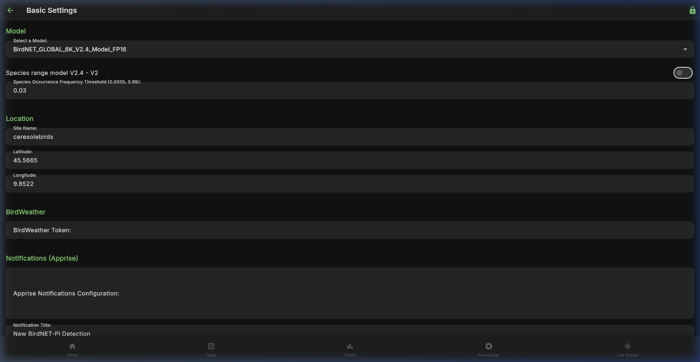

### Advanced Settings
Fine-grained control over the BirdNET engine and system behavior:
- **Recordings Privacy**: Threshold settings.
- **Disk Space Management**: Automatic purging strategies.
- **Audio Settings**: Device selection, channels, overlap, and recording/extraction lengths.
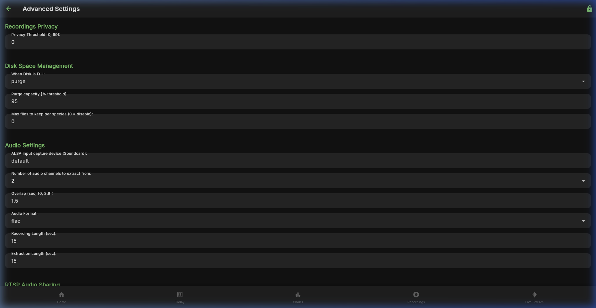

### System Tools
Real-time monitoring and administrative controls:
- **System Status**: Branch information, uptime, disk usage, memory, and CPU temperature.
- **System Controls**: Restart, Update, Shutdown, and Clear All Data.
- **Other Utilities**: Access to System Info, File Manager, and Database Maintenance.
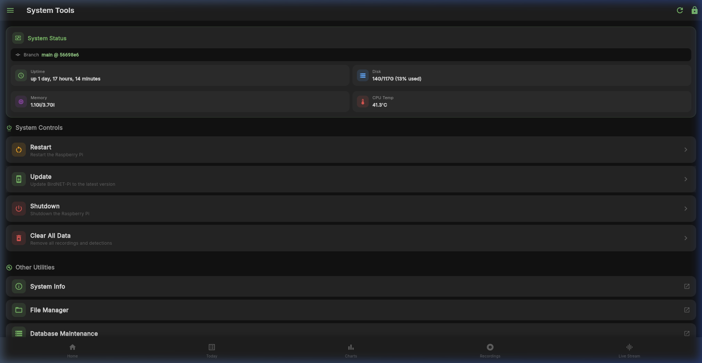
